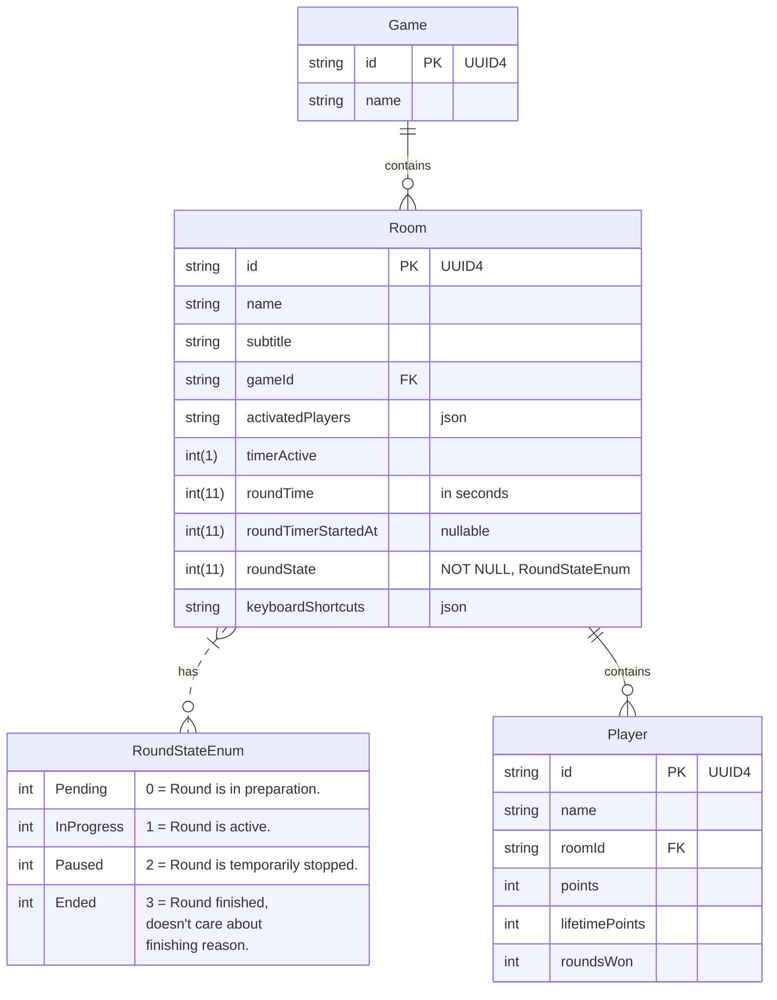

# Scoreboard

Use this scoreboard to display your live game scores.

## Project goals

* Build a minimum scoreboard.
* Support the starry cluster ball game known from Youtube in the beginning.
* Build a minimum project which runs alone in the browser first, with no external database. Just use browser database features.
* Later, we might add an online service or database.
* Free for use and open source with basic features.


## Ideas

* We could make that colors for every player could be defined.
  * We always would have a primary and a secondary color, so if colors of 2 players are too close, the system could choose the alternative color scheme. But maybe that is too much overload. We'll see.

* Bring structure to code.
  * Currently I will not refactor the system.
  * A future approach might optimize the base system, to reflect more kinds of sports. See Concepts > Data Hierarchy for more information.

* Add more animations. Inspirations:
  * Look at the CSS text animation here: https://prismic.io/blog/css-animation-examples
    * CSS Text
    * CSS party
    * Sparkly Shiny Text
    * Rainbow Gradient
    * Storm Button
    * Making pancake loader (Up the stairs!)

  * This is also a nice source: https://www.sliderrevolution.com/resources/css-text-animation/
    * Rainbow
    * Pure CSS | FadeIn Text with bars
    * Animated "text-shadow" pattern
    * Interstellar
    * NEON
    * CSS Particle Effects

  * State Machine Architecture
    * Learn more about state machines, like the ones, that are for example used overall the nes game logic.
    * Start effects and animations, when specific states are reached.

  * Add "Loosing points" animations.
    * Currently, only animations are shown, when the player earns points. Additionally, we could add animations, whenever the value is negative with special animations for that.


## Concept

### Database 



#### Data Hierarchy

The projects data hierarchie is flat by design. It should be as simple as possible, because complexity is a killer.

```Game > Room > Player ```


#### Game

Game represents the concept of a game. There are many different kind of games, but we go down into the detail,
so this usually does not represent a general group, but the dedicated game with it's rulesets, that can be played.


#### Room

A room is one scoreboard instance.
The system is kept short in this part,
since we really want to focus on the scoreboard for the moment,
not on a big score-tracking system.


#### Player

For simplicity, a room just contains players.
A player can be a real player, or a team.

If we need more complexity, we'd add it for different boards,
or revise the system later. But for now we are good with
keep it stupid simple.


## API

The system is using an api to save data.
The API is currently only implemented locally in the browser, and saves data in an indexed db.
It acts like a usual REST-API, meaning, it takes command-type, endpoint and parameters.
In a future version it can use the methods to save data on a server - it just needs an additional implementation of the API then.

